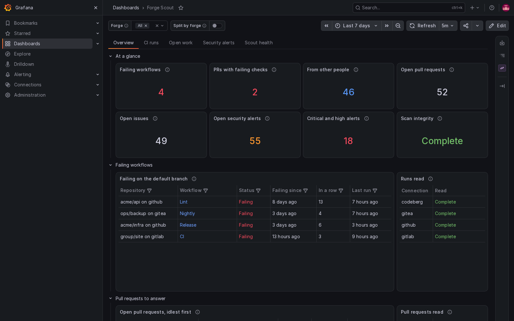

# github-scout

[](https://github.com/cplieger/github-scout/pkgs/container/github-scout) [](https://github.com/cplieger/github-scout/pkgs/container/github-scout) [](https://github.com/cplieger/github-scout/blob/main/Dockerfile) [](https://github.com/cplieger/github-scout/issues?q=label%3Agremlins-tracker) [](https://github.com/cplieger/github-scout/releases)

<!-- hub-overview BEGIN -->
github-scout puts the open pull requests, open issues, code-scanning alerts and failed Actions runs across your GitHub repositories on one Grafana dashboard, with a link on every row. It only reads from GitHub.



## What it does

github-scout shows you what is waiting for you across all your repositories, in one place:

- Lists open pull requests and issues, newest first, leaving out Renovate's by default.
- Lists open code-scanning alerts, colored by severity.
- Lists failed, timed-out and startup-failed Actions runs, with a link to each run.
- Adds a new repository or workflow on the next scan, with nothing to configure.
- Marks the counts a scan could not check, so you can tell an unchecked zero from a confirmed zero.

## Who it is for

github-scout is built for people with many GitHub repositories, private ones included. It checks each repository every 15 minutes. It covers up to 500 repositories of your own github.com account, not organization repositories or Dependabot alerts.

github-scout reports through its log, so its dashboard and alerts come from your Grafana, Loki and Alertmanager, which the [monitoring guide](https://github.com/cplieger/docs/blob/main/docs/monitoring.md#the-smallest-stack-sends-notifications-only) sets up. You also need a read-only GitHub personal access token.

Other tools suit other needs:

- Consider the [Grafana GitHub data source](https://grafana.com/grafana/plugins/grafana-github-datasource/) if you want Grafana panels that query the GitHub API directly for your repositories and projects.
- Consider [gh-dash](https://github.com/dlvhdr/gh-dash) if you want to work through pull requests and issues from a terminal, with diff, comment and checkout built in.

github-scout is free software under the GPL-3.0-or-later license.
<!-- hub-overview END -->

## Quick start

The image is on GitHub Container Registry and Docker Hub, for `amd64` and `arm64`. This is the [`compose.yaml`](compose.yaml) in this repository.

```yaml
services:
  github-scout:
    image: ghcr.io/cplieger/github-scout:latest
    container_name: github-scout
    restart: unless-stopped

    environment:
      # Before the first start, create a .env file beside this file with two lines,
      # GITHUB_OWNER=<your GitHub login> and GITHUB_TOKEN=<a read-only token>. The README lists the token permissions.
      GITHUB_OWNER: "${GITHUB_OWNER:?set GITHUB_OWNER - the login whose repos to scan}"
      GITHUB_TOKEN: "${GITHUB_TOKEN:?set GITHUB_TOKEN - see README for token scopes}"
      SCAN_INTERVAL: "15m"  # time between scans, such as 15m or 1h
```

1. On GitHub, create a [fine-grained personal access token](https://github.com/settings/personal-access-tokens/new) for your account.
2. Give the token **All repositories**, and **Read-only** access to **Actions**, **Pull requests**, **Issues** and **Code scanning alerts**.
3. In the folder that holds `compose.yaml`, create a file named `.env` with your login and the token:

   ```text
   GITHUB_OWNER=your-login
   GITHUB_TOKEN=github_pat_your_token
   ```

4. Run `docker compose up -d`.
5. Have your log collector [send the container's logs to Loki](https://github.com/cplieger/docs/blob/main/docs/monitoring.md#the-smallest-stack-sends-notifications-only) with the label `container="github-scout"`, which every dashboard panel selects on.
6. In Grafana 13.2 or newer, [import](https://github.com/cplieger/docs/blob/main/docs/monitoring.md#importing-an-apps-dashboard) [`grafana-dashboard.json`](grafana-dashboard.json). It reads from your default Loki data source.

On Grafana 13.1 or older, take `grafana-dashboard.json` from release [v2.3.0](https://github.com/cplieger/github-scout/releases/tag/v2.3.0), the last one in the older dashboard format. That file gets no further changes, so you maintain it yourself.

Run `docker logs github-scout`. You should see a line with `"msg":"scan complete"`. If you see `"msg":"repo discovery failed"` instead, GitHub rejected the token or could not be reached. Check the `GITHUB_TOKEN` line of `.env`.

## Configuration reference

Settings are environment variables, read once at start, so recreate the container after a change. github-scout needs no volume and opens no port.

| Variable | Description | Default |
| --- | --- | --- |
| `GITHUB_OWNER` | Your GitHub login. One container scans the repositories this one account owns | required |
| `GITHUB_TOKEN` | A read-only personal access token of that account, with the [permissions](docs/configuration.md#token-permissions) above | required |
| `SCAN_INTERVAL` | Time between scans, such as `15m` or `1h`, from 1 minute to 365 days | `15m` |
| `LOOKBACK_HOURS` | How many hours back each scan reads finished Actions runs, from 1 to 720 | `72` |
| `EXCLUDE_REPOS` | Comma-separated repository names, without the owner, left out of every list | _(unset)_ |
| `CODE_SCANNING_EXCLUDE_REPOS` | Comma-separated repository names whose code-scanning alerts are not read. Their runs, pull requests and issues stay | _(unset)_ |
| `CODE_SCANNING_EXCLUDE_FORKS` | Skip code-scanning alerts on every fork, which reports the alerts of the code it copied. `false` reads them | `true` |
| `PR_EXCLUDE_QUERY` | GitHub search terms added to the open pull request search | `-author:app/renovate` |
| `ISSUE_EXCLUDE_QUERY` | GitHub search terms added to the open issue search | `-author:app/renovate -label:renovate -label:auto-generated` |
| `LOG_LEVEL` | `debug`, `info`, `warn` or `error` | `info` |

A value github-scout cannot read falls back to its default, and a value out of range is moved to the nearest limit. [Configuration](docs/configuration.md) explains the token, the exclusions and the one-shot `trigger` command.

## Security

github-scout opens no port and runs no web server. It sends only read requests, and only to `api.github.com`, so give it a read-only token. The token travels only in the request header to GitHub and never appears in the log, which records only whether a token is set. Keep `.env` out of git.

The image is distroless, with no shell, and runs as a non-root user. It writes only to `/tmp`, where it keeps a health marker and two small state files. [Security](docs/hardening.md) has the hardened compose settings and what the image contains.

## Troubleshooting

The healthcheck runs `/github-scout health`, which checks that the scan loop refreshed its marker file within the last three scan intervals, 45 minutes at the default. Unhealthy means the loop stopped, so restart the container. The container stays healthy through a failed scan, a rejected token or a rate limit. Those appear in the log, and the bundled alert rules fire on them.

- If `docker compose up` stops with `set GITHUB_OWNER` or `set GITHUB_TOKEN`, the `.env` file is missing that line or is not beside `compose.yaml`.
- If the log shows `"msg":"repo discovery failed"`, GitHub rejected the token or could not be reached. Check that the token in `.env` has not expired.
- If the log shows `"cause":"no_repos_visible"`, the token sees no repository owned by `GITHUB_OWNER`. Set it to the login of the account that created the token.
- If every scan logs `code scanning listing failed` for the same private repository, that repository has no GitHub Advanced Security. Add its name to `CODE_SCANNING_EXCLUDE_REPOS`.

## Monitoring

github-scout writes one JSON log line for each open pull request, issue, alert and finished run, plus a `scan complete` summary after each scan. The bundled dashboard needs Grafana 13.2 or newer and reads those lines from Loki, and two Loki alert rules fire when scans go blind or stop. [Monitoring and alerts](docs/monitoring.md) lists the log fields, the dashboard and the rules.

## Documentation

- [Configuration](docs/configuration.md) covers the token permissions, the exclusions and one-shot scans.
- [Monitoring and alerts](docs/monitoring.md) covers the log lines, the Grafana dashboard and the alert rules.
- [Security](docs/hardening.md) covers the hardened compose settings and what the image contains.
- [How github-scout works](docs/how-it-works.md) covers scanning, deduplication and GitHub API use.

## Credits

github-scout reads the [GitHub REST API](https://docs.github.com/en/rest). The way its API client authenticates, sets the API version and pages through results follows two Prometheus exporters for GitHub, [githubexporter/github-exporter](https://github.com/githubexporter/github-exporter) and [xrstf/github_exporter](https://github.com/xrstf/github_exporter). [THIRD_PARTY_NOTICES.md](THIRD_PARTY_NOTICES.md) names each pattern.

## Contributing

See [CONTRIBUTING.md](CONTRIBUTING.md).

## Disclaimer

This project is built with care and follows security best practices, but it is intended for personal / self-hosted use. No guarantees of fitness for production environments. Use at your own risk.

This project was built with AI-assisted tooling using [Claude](https://claude.com), [GPT](https://openai.com), and [Kiro](https://kiro.dev). The human maintainer defines architecture, supervises implementation, and makes all final decisions.

## License

GPL-3.0-or-later. See [LICENSE](LICENSE). The image carries the license text of every bundled component under `/usr/share/licenses/`.

Third-party attributions are in [THIRD_PARTY_NOTICES.md](THIRD_PARTY_NOTICES.md).
